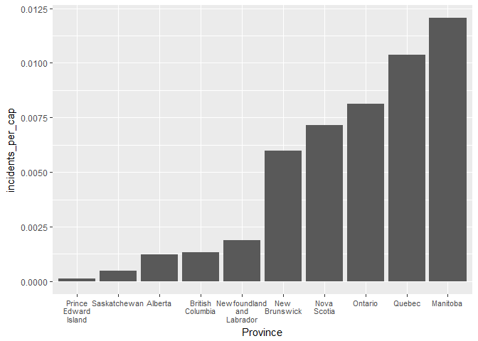
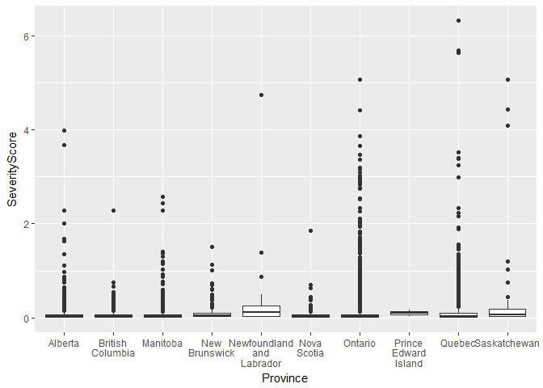
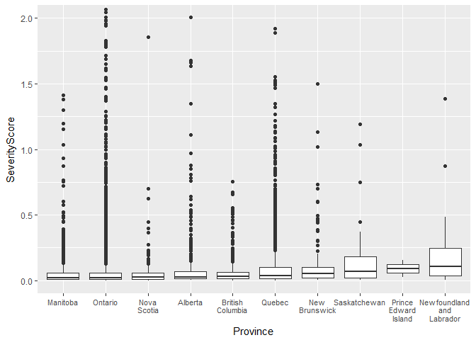
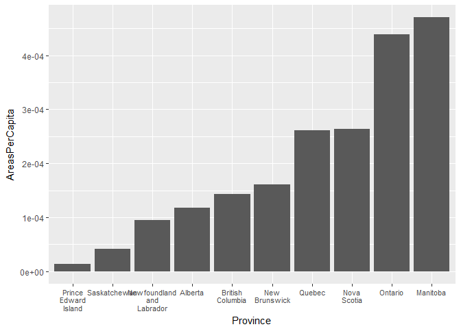
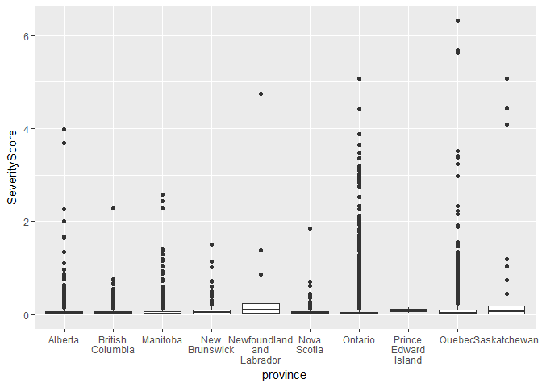

Analyzing Hazard Data
================
Alec Sampaleanu
March 25, 2018

Setup
-----

``` r
library(tidyverse)
library(ggmap)
library(modelr)
```

``` r
hazarddat <- read.csv("hazarddat.csv")

glimpse(hazarddat)
```

    ## Observations: 67,185
    ## Variables: 23
    ## $ X               <int> 1, 2, 3, 4, 5, 6, 7, 8, 9, 10, 11, 12, 13, 14,...
    ## $ AvgLatitude     <dbl> 45.46766, 45.46660, 45.58343, 45.58433, 45.584...
    ## $ AvgLongitude    <dbl> -73.50730, -73.58055, -73.49925, -73.50351, -7...
    ## $ MinLatitude     <dbl> 45.46692, 45.46555, 45.58228, 45.58365, 45.583...
    ## $ MinLongitude    <dbl> -73.50815, -73.58093, -73.49991, -73.50403, -7...
    ## $ MaxLatitude     <dbl> 45.46829, 45.46692, 45.58365, 45.58502, 45.585...
    ## $ MaxLongitude    <dbl> -73.50677, -73.57956, -73.49854, -73.50266, -7...
    ## $ County          <fctr> , , , , , , , , , , , , , , , , , , , , , , , , 
    ## $ State           <fctr> , , , , , , , , , , , , , , , , , , , , , , , , 
    ## $ Country         <fctr> , , , , , , , , , , , , , , , , , Colombia, C...
    ## $ ISO_3166_2      <fctr> , , , , , , , , , , , , , , , , , CO, CO, CO,...
    ## $ SeverityScore   <dbl> 0.2688, 0.1168, 0.4039, 0.3704, 0.3938, 0.5583...
    ## $ NumberIncidents <int> 243, 114, 32, 24, 30, 31, 83, 72, 52, 49, 436,...
    ## $ Rationale       <lgl> NA, NA, NA, NA, NA, NA, NA, NA, NA, NA, NA, NA...
    ## $ CarIncidents    <int> 1, 1, 0, 0, 0, 0, 0, 0, 0, 1, 0, 2, 0, 0, 0, 0...
    ## $ MpvIncidents    <int> 2, 1, 1, 0, 0, 0, 5, 0, 0, 0, 5, 13, 0, 3, 10,...
    ## $ LdtIncidents    <int> 0, 0, 0, 0, 0, 0, 3, 2, 0, 0, 1, 7, 0, 2, 2, 9...
    ## $ MdtIncidents    <int> 11, 5, 0, 2, 1, 2, 12, 0, 1, 5, 61, 109, 6, 1,...
    ## $ HdtIncidents    <int> 183, 83, 28, 22, 25, 25, 48, 52, 45, 33, 297, ...
    ## $ OtherIncidents  <int> 46, 24, 3, 0, 4, 4, 15, 18, 6, 10, 72, 206, 12...
    ## $ UpdateDate      <fctr> 2018-01-02, 2018-01-02, 2018-01-02, 2018-01-0...
    ## $ Version         <int> 1, 1, 1, 1, 1, 1, 1, 1, 1, 1, 1, 1, 1, 1, 1, 1...
    ## $ City            <lgl> NA, NA, NA, NA, NA, NA, NA, NA, NA, NA, NA, NA...

This is the hazardous driving dataset in its out-of-the-box form from GeoTab. The first thing to note is that this dataset has observations from outside of Canada. Since the focus of this project is on hazardous driving in Canada, we'll create a new data frame called hazardcan.

``` r
hazardcan <- hazarddat %>%
  filter(Country == "Canada") %>%
  rename(province = State)
```

This is a big data frame with over 10000 observations and 23 variables. Are all of these variables useful?

``` r
remove <- c("County", "Rationale", "City", "Country", "ISO_3166_2")

hazardcan <- hazardcan %>%
  select(-one_of(remove))
```

County, City, and Rationale are all empty columns, and so are discarded. Country and the ISO designation are not needed either. At this point we have the data frame we'd like to proceed with.

Number of Incidents
-------------------

A very basic first step is to simply determine which province has the highest number of incidents within hazardous deiving zones.

``` r
incidentprov <- hazardcan %>%
  group_by(province) %>%
  summarise(TotalIncidents = sum(NumberIncidents))

incidentprov
```

    ## # A tibble: 10 x 2
    ##    province                  TotalIncidents
    ##    <fctr>                             <int>
    ##  1 Alberta                             4968
    ##  2 British Columbia                    6158
    ##  3 Manitoba                           15412
    ##  4 New Brunswick                       4467
    ##  5 Newfoundland and Labrador            977
    ##  6 Nova Scotia                         6617
    ##  7 Ontario                           109283
    ##  8 Prince Edward Island                  19
    ##  9 Quebec                             84791
    ## 10 Saskatchewan                         516

This table shows that Ontario has the highest total number of hazardous driving incidents of any province in Canada. But what about incidents in respect to total population?

``` r
populationprov <- read.csv("population.csv") %>%
  select(c(2,4)) %>%
  slice(c(2:11)) %>%
  rename(province = Geographic.name) %>%
  rename(population = Population..2016)

incidentprov <- incidentprov %>%
  inner_join(populationprov, by = "province") %>%
  mutate(incidents_per_cap = TotalIncidents / population)

plotprov <- incidentprov

plotprov$province <- gsub(" ", "\n", plotprov$province)

ggplot(plotprov, aes(reorder(province, incidents_per_cap), incidents_per_cap)) +
  geom_bar(stat="identity") + labs(x = "Province") + 
  theme(axis.text.x = element_text(size = 8), )
```



Using population statistics taken from the 2016 Census, we can determine each provinces ratio of incidents per capita. In terms of incidents per capita, Manitoba is the most dangerous province, and PEI is the least dangerous. Is the number of incidents really the best way to determine danger, however? Incidents in this data set range from harsh braking to multi-vehicle incidents, so clearly there is a range of severity. That's where the Severity Score comes in.

Severity Score
--------------

``` r
plotcan <- hazardcan

plotcan$province <- gsub(" ", "\n", plotcan$province)

plotcan %>%
  ggplot(aes(province, SeverityScore)) + geom_boxplot()
```



Not very useful, unfortunately, so lets focus in on the lower ranges.

``` r
plotcan %>%
  ggplot(aes(reorder(province, SeverityScore, median), SeverityScore)) + geom_boxplot() +
  coord_cartesian(ylim = c(0, 2)) + labs(x = "Province") + 
  theme(axis.text.x = element_text(size = 8), )
```



It seems that Newfoundland has the highest median Severity Score for its hazardous driving areas, while Manitoba has the lowest. This is very interesting, because Manitoba was the province with the highest total number of incidents.

``` r
hazardcan %>%
  filter(province == "Newfoundland and Labrador") %>%
  count()
```

    ## # A tibble: 1 x 1
    ##       n
    ##   <int>
    ## 1    49

``` r
hazardcan %>%
  filter(province == "Prince Edward Island") %>%
  count()
```

    ## # A tibble: 1 x 1
    ##       n
    ##   <int>
    ## 1     2

``` r
hazardcan %>%
  filter(province == "Saskatchewan") %>%
  count()
```

    ## # A tibble: 1 x 1
    ##       n
    ##   <int>
    ## 1    46

Of the three provinces with the highest median severity scores, none has more than 50 hazardous driving zones. In fact, PEI only has 2!

``` r
severityprov <- hazardcan %>%
  group_by(province) %>%
  summarise(areas = n()) %>%
  inner_join(populationprov, by = "province") %>%
  mutate(areas_per_cap = areas / population)

plotseverityprov <- severityprov

plotseverityprov$province <- gsub(" ", "\n", plotseverityprov$province)

plotseverityprov %>%
  ggplot(aes(reorder(province, areas_per_cap), areas_per_cap)) + 
  geom_bar(stat = "identity") + labs(x = "Province") + 
  theme(axis.text.x = element_text(size = 8))
```



PEI, Newfoundland, and Saskatchewan's hazardous driving areas have the highest severity scores, but they are also the provinces with the fewest number of hazardous driving areas in proportion to their population.

Hazardous Driving
-----------------

At this point we need to decide on a definition of hazardous driving. Is it more dangerous to drive in a province with very many low hazard zones, or one with a fewer number of higher severity zones? And for measuring the average severity of a province, should we use median or mean?

``` r
hazardcan %>%
  group_by(province) %>%
  summarise(median_sev = median(SeverityScore)) %>%
  arrange(-median_sev)
```

    ## # A tibble: 10 x 2
    ##    province                  median_sev
    ##    <fctr>                         <dbl>
    ##  1 Newfoundland and Labrador     0.108 
    ##  2 Prince Edward Island          0.0906
    ##  3 Saskatchewan                  0.0668
    ##  4 New Brunswick                 0.0510
    ##  5 Quebec                        0.0364
    ##  6 British Columbia              0.0310
    ##  7 Alberta                       0.0261
    ##  8 Nova Scotia                   0.0260
    ##  9 Ontario                       0.0219
    ## 10 Manitoba                      0.0216

This is a table of the median severity scores,

``` r
hazardcan %>%
  group_by(province) %>%
  summarise(mean_sev = mean(SeverityScore)) %>%
  arrange(-mean_sev)
```

    ## # A tibble: 10 x 2
    ##    province                  mean_sev
    ##    <fctr>                       <dbl>
    ##  1 Saskatchewan                0.439 
    ##  2 Newfoundland and Labrador   0.272 
    ##  3 New Brunswick               0.130 
    ##  4 Quebec                      0.115 
    ##  5 Alberta                     0.109 
    ##  6 Prince Edward Island        0.0906
    ##  7 Manitoba                    0.0863
    ##  8 Ontario                     0.0808
    ##  9 British Columbia            0.0660
    ## 10 Nova Scotia                 0.0603

These are very different distributions, and the reason why can be seen if we re-examine the distributions of severity for each province.

``` r
plotcan <- hazardcan

plotcan$province <- gsub(" ", "\n", plotcan$province)

plotcan %>%
  ggplot(aes(province, SeverityScore)) + geom_boxplot()
```



Median is an average that tends to ignore outliers more than mean. In the situation of hazardous driving zones, provinces like Ontario and Quebec have a ridiculous number of zones, most of which are low severity. However, they also have severe zones, unlike PEI, which median does not take into account but mean does.

Is there a way to rate each province based on both mean severity and number of zones per capita?

Normalization
-------------

We're going to attempt to normalize both areas per capita and mean severity so that they both are measured on a scale of 0 to 1, where 1 is the max value of that variable in our dataset.

``` r
hazardcan %>%
  group_by(province) %>%
  summarize(mean_sev = mean(SeverityScore), areas = n()) %>%
  inner_join(populationprov, by = "province") %>%
  mutate(areas_per_cap = areas / population) %>%
  mutate(norm_mean_sev = (mean_sev - min(mean_sev)) / 
                         (max(mean_sev) - min(mean_sev)), 
         norm_areas_per_cap = (areas_per_cap - min(areas_per_cap)) /
                              (max(areas_per_cap) - min(areas_per_cap))) %>%
  mutate(score = ((norm_mean_sev + norm_areas_per_cap) / 2)) %>% 
  mutate(rank = as.integer(rank(-score))) %>%
  select(province, score, rank) %>%
  arrange(rank)
```

    ## # A tibble: 10 x 3
    ##    province                   score  rank
    ##    <chr>                      <dbl> <int>
    ##  1 Manitoba                  0.534      1
    ##  2 Saskatchewan              0.531      2
    ##  3 Ontario                   0.493      3
    ##  4 Newfoundland and Labrador 0.368      4
    ##  5 Quebec                    0.343      5
    ##  6 Nova Scotia               0.273      6
    ##  7 New Brunswick             0.253      7
    ##  8 Alberta                   0.177      8
    ##  9 British Columbia          0.149      9
    ## 10 Prince Edward Island      0.0401    10

We then combined the two normalized scales into one value, and then ranked the provinces based on this value. Using this ranking, we determine that Manitoba is the most dangerous province to drive in, closely followed by Saskatchewan. PEI is the safest province, by a large margin.

Adding more data
----------------

This ranking is good as is, but we would like to know if adding other data can improve these rankings. The issue with the Geotab data is that it comes only from vehicles that are in their network of sensors. Most of their network is composed of trucks, with cars making up a small portion of the fleet. This can lead to areas with heavy trucking being overrated in terms of hazard, while areas with low trucking may be underrated. As well, the Severity Score calculated by Geotab does not take into account the number of victims of each incident.

``` r
province_fat <- data_frame(
  province = c("Newfoundland and Labrador", "Prince Edward Island", "Nova Scotia", 
               "New Brunswick","Quebec", "Ontario", "Manitoba", "Saskatchewan", 
               "Alberta", "British Columbia"),
  fat_per_bvk = c(8.2, 12.3, 4.8, 6.0, 4.9, 3.7, 5.5, 8.7, 5.5, 7.7)
)

provrank <- hazardcan %>%
  group_by(province) %>%
  summarize(mean_sev = mean(SeverityScore), areas = n()) %>%
  inner_join(populationprov, by = "province") %>%
  mutate(areas_per_cap = areas / population) %>%
  inner_join(province_fat, by = "province") %>%
  mutate(norm_mean_sev = (mean_sev - min(mean_sev)) / 
                         (max(mean_sev) - min(mean_sev)), 
         norm_areas_per_cap = (areas_per_cap - min(areas_per_cap)) /
                              (max(areas_per_cap) - min(areas_per_cap)),
         norm_fat_per_bvk = (fat_per_bvk - min(fat_per_bvk)) /
                            (max(fat_per_bvk) - min(fat_per_bvk))) %>%
  mutate(score = ((norm_mean_sev + norm_areas_per_cap + norm_fat_per_bvk) / 3)) %>% 
  mutate(rank = as.factor(rank(-score))) %>%
  select(province, score, rank) %>%
  arrange(rank)

provrank
```

    ## # A tibble: 10 x 3
    ##    province                  score rank  
    ##    <chr>                     <dbl> <fctr>
    ##  1 Saskatchewan              0.548 1     
    ##  2 Manitoba                  0.426 2     
    ##  3 Newfoundland and Labrador 0.420 3     
    ##  4 Prince Edward Island      0.360 4     
    ##  5 Ontario                   0.329 5     
    ##  6 Quebec                    0.275 6     
    ##  7 New Brunswick             0.258 7     
    ##  8 British Columbia          0.255 8     
    ##  9 Nova Scotia               0.225 9     
    ## 10 Alberta                   0.188 10

This updated ranking takes into account the Canadian Motor Vehicle Traffic Collision Statistics for 2015 collected by the Government of Canada, specifically the data that tracks traffic fatalities per billion vehicle-kilometres. What we see immediately is that PEI jumps up from the bottom to 4th most dangerous province. PEI has by far the most fatalities per billion vehicle-kilometres, meaning that it's ridiculously low-score in the old ranking is not indicative of the realities of driving in the province.

How many roads?
---------------

``` r
roadprov <- data_frame(
  province = c("Newfoundland and Labrador", "Prince Edward Island", "Nova Scotia", 
               "New Brunswick","Quebec", "Ontario", "Manitoba", "Saskatchewan", 
               "Alberta", "British Columbia"),
  tkm_road = c(19.3, 6.0, 27.1, 31.5, 144.7, 191.0, 86.6, 228.2, 226.3, 71.1)
)

hazardcan %>%
  group_by(province) %>%
  summarize(mean_sev = mean(SeverityScore), areas = n()) %>%
  inner_join(roadprov, by = "province") %>%
  mutate(areas_per_tkm_road = areas / tkm_road) %>%
  inner_join(province_fat, by = "province") %>%
  mutate(norm_mean_sev = (mean_sev - min(mean_sev)) / 
                         (max(mean_sev) - min(mean_sev)), 
         norm_areas_per_tkm_road = (areas_per_tkm_road - min(areas_per_tkm_road)) /
                              (max(areas_per_tkm_road) - min(areas_per_tkm_road)),
         norm_fat_per_bvk = (fat_per_bvk - min(fat_per_bvk)) /
                            (max(fat_per_bvk) - min(fat_per_bvk))) %>%
  mutate(score = ((norm_mean_sev + norm_areas_per_tkm_road + norm_fat_per_bvk) / 3)) %>% 
  mutate(rank = as.factor(rank(-score))) %>%
  select(province, score, rank) %>%
  arrange(rank)
```

    ## # A tibble: 10 x 3
    ##    province                  score rank  
    ##    <chr>                     <dbl> <fctr>
    ##  1 Saskatchewan              0.527 1     
    ##  2 Newfoundland and Labrador 0.386 2     
    ##  3 Prince Edward Island      0.361 3     
    ##  4 Ontario                   0.351 4     
    ##  5 British Columbia          0.259 5     
    ##  6 Quebec                    0.252 6     
    ##  7 New Brunswick             0.190 7     
    ##  8 Manitoba                  0.166 8     
    ##  9 Nova Scotia               0.138 9     
    ## 10 Alberta                   0.133 10
