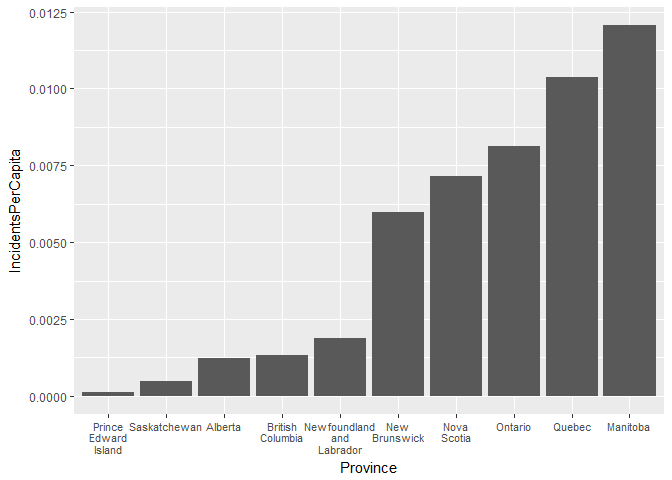

Analyzing Hazard Data
================
Alec Sampaleanu
March 25, 2018

Setup
-----

``` r
library(tidyverse)
```

``` r
hazarddat <- read.csv("hazarddat.csv")

glimpse(hazarddat)
```

    ## Observations: 67,185
    ## Variables: 23
    ## $ X               <int> 1, 2, 3, 4, 5, 6, 7, 8, 9, 10, 11, 12, 13, 14,...
    ## $ AvgLatitude     <dbl> 45.46766, 45.46660, 45.58343, 45.58433, 45.584...
    ## $ AvgLongitude    <dbl> -73.50730, -73.58055, -73.49925, -73.50351, -7...
    ## $ MinLatitude     <dbl> 45.46692, 45.46555, 45.58228, 45.58365, 45.583...
    ## $ MinLongitude    <dbl> -73.50815, -73.58093, -73.49991, -73.50403, -7...
    ## $ MaxLatitude     <dbl> 45.46829, 45.46692, 45.58365, 45.58502, 45.585...
    ## $ MaxLongitude    <dbl> -73.50677, -73.57956, -73.49854, -73.50266, -7...
    ## $ County          <fctr> , , , , , , , , , , , , , , , , , , , , , , , , 
    ## $ State           <fctr> , , , , , , , , , , , , , , , , , , , , , , , , 
    ## $ Country         <fctr> , , , , , , , , , , , , , , , , , Colombia, C...
    ## $ ISO_3166_2      <fctr> , , , , , , , , , , , , , , , , , CO, CO, CO,...
    ## $ SeverityScore   <dbl> 0.2688, 0.1168, 0.4039, 0.3704, 0.3938, 0.5583...
    ## $ NumberIncidents <int> 243, 114, 32, 24, 30, 31, 83, 72, 52, 49, 436,...
    ## $ Rationale       <lgl> NA, NA, NA, NA, NA, NA, NA, NA, NA, NA, NA, NA...
    ## $ CarIncidents    <int> 1, 1, 0, 0, 0, 0, 0, 0, 0, 1, 0, 2, 0, 0, 0, 0...
    ## $ MpvIncidents    <int> 2, 1, 1, 0, 0, 0, 5, 0, 0, 0, 5, 13, 0, 3, 10,...
    ## $ LdtIncidents    <int> 0, 0, 0, 0, 0, 0, 3, 2, 0, 0, 1, 7, 0, 2, 2, 9...
    ## $ MdtIncidents    <int> 11, 5, 0, 2, 1, 2, 12, 0, 1, 5, 61, 109, 6, 1,...
    ## $ HdtIncidents    <int> 183, 83, 28, 22, 25, 25, 48, 52, 45, 33, 297, ...
    ## $ OtherIncidents  <int> 46, 24, 3, 0, 4, 4, 15, 18, 6, 10, 72, 206, 12...
    ## $ UpdateDate      <fctr> 2018-01-02, 2018-01-02, 2018-01-02, 2018-01-0...
    ## $ Version         <int> 1, 1, 1, 1, 1, 1, 1, 1, 1, 1, 1, 1, 1, 1, 1, 1...
    ## $ City            <lgl> NA, NA, NA, NA, NA, NA, NA, NA, NA, NA, NA, NA...

This is the hazardous driving dataset in its out-of-the-box form from GeoTab. The first thing to note is that this dataset has observations from outside of Canada. Since the focus of this project is on hazardous driving in Canada, we'll create a new data frame called hazardcan.

``` r
hazardcan <- hazarddat %>%
  filter(Country == "Canada") %>%
  rename(Province = State)
```

This is a big data frame with over 10000 observations and 23 variables. Are all of these variables useful?

``` r
sum(!is.na(hazardcan$Rationale))
```

    ## [1] 0

``` r
sum(!is.na(hazardcan$City))
```

    ## [1] 0

``` r
sum(hazardcan$County != "")
```

    ## [1] 0

``` r
remove <- c("County", "Rationale", "City", "Country", "ISO_3166_2")

hazardcan <- hazardcan %>%
  select(-one_of(remove))
```

County, City, and Rationale are all empty columns, and so are discarded. Country and the ISO designation are not needed either. At this point we have the data frame we'd like to proceed with.

Number of Incidents
-------------------

A very basic first step is to simply determine which province has the highest number of incidents within hazardous deiving zones.

``` r
incidentprov <- hazardcan %>%
  group_by(Province) %>%
  summarise(TotalIncidents = sum(NumberIncidents))

incidentprov
```

    ## # A tibble: 10 x 2
    ##    Province                  TotalIncidents
    ##    <fctr>                             <int>
    ##  1 Alberta                             4968
    ##  2 British Columbia                    6158
    ##  3 Manitoba                           15412
    ##  4 New Brunswick                       4467
    ##  5 Newfoundland and Labrador            977
    ##  6 Nova Scotia                         6617
    ##  7 Ontario                           109283
    ##  8 Prince Edward Island                  19
    ##  9 Quebec                             84791
    ## 10 Saskatchewan                         516

This table shows that Ontario has the highest total number of hazardous driving incidents of any province in Canada. But what about incidents in respect to total population?

``` r
populationprov <- read.csv("population.csv") %>%
  select(c(2,4)) %>%
  slice(c(2:11)) %>%
  rename(Province = Geographic.name) %>%
  rename(Population = Population..2016)

incidentprov <- incidentprov %>%
  inner_join(populationprov, by = "Province") %>%
  mutate(IncidentsPerCapita = TotalIncidents / Population)

incidentprov$Province <- gsub(" ", "\n", incidentprov$Province)

ggplot(incidentprov, aes(reorder(Province, IncidentsPerCapita), IncidentsPerCapita)) +
  geom_bar(stat="identity") + labs(x = "Province") + 
  theme(axis.text.x = element_text(size = 8))
```


